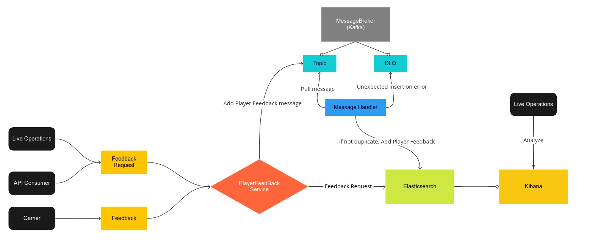

# PlayerFeedbackService

## Prerequisite
* Docker
* Docker Compose
* .NET 5 (optional)

## How to start the service locally
* On Mac/Linux, run `bash start_app.sh` on Terminal
* On Windows, run `start_app.cmd` on CMD
* If you run into error about disk space running out, run `docker system prune` (at your own discretion) and `docker-compose up` in root project folder 
  and then run `dotnet run --project src/PlayerFeedbackService/PlayerFeedbackService.csproj` (this will spawn docker containers only for infrastructure
  and run the service natively on your machine)

## How to shut down the service
* On Max/Linux, run `bash stop_app.sh` on Terminal
* On Windows, run `stop_app.cmd` on CMD

## How to run tests
* On Max/Linux, run `bash run_tests.sh` on Terminal
* On Windows, run `run_tests.cmd` on CMD
* If you have .NET 5 on your machine, run `dotnet test` on your Terminal (it's much faster :))

## Service Overview

## API Specification
* Start the service and open up `http://localhost:5000/swagger/index.html` on your browser to see automatically generated swagger

## How to use PlayerFeedbackService
* Once the service is up and running, you can make requests using `POSTMAN`, `curl` and `http://localhost:5000/swagger/index.html`
* To see the persisted data, open `http://localhost:5601` on your browser to open Kibana. Use `Dev Tool` to query the data
